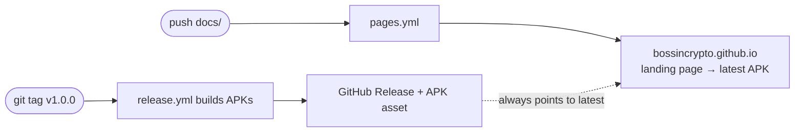

<div align="center">


# ⏱️ Mini Time Widget

**Two time zones, one tiny Android widget.**  
A minimalist 1×2 home-screen widget with zero battery drain and zero dependencies.

[English](README.md) · [Русский](README.ru.md)

[](https://github.com/BOSSincrypto/mini-time-widget/releases/latest)
[](https://github.com/BOSSincrypto/mini-time-widget/releases)
[](https://github.com/BOSSincrypto/mini-time-widget/actions/workflows/build.yml)
[](https://bossincrypto.github.io/mini-time-widget/)

[](https://kotlinlang.org)
[](https://developer.android.com/about/versions/o)
[](#)
[](LICENSE)

🌐 **Landing page:** <https://bossincrypto.github.io/mini-time-widget/>  
📦 **Download APK:** <https://github.com/BOSSincrypto/mini-time-widget/releases/latest>

</div>

---

> A 1×2 Android widget that shows two clocks from different time zones side by side. It ticks **for free** using the system's own `TextClock` — no background services, no alarms, no polling — so your battery never notices it's there.

## ✨ Features

- **🧩 1×2 widget** — two clocks (`City + HH:mm`) from different time zones on a single widget
- **🔋 Zero battery drain** — time ticks via `TextClock` inside `RemoteViews`; `updatePeriodMillis = 0`, no services, no alarms
- **🪶 Zero dependencies** — pure Kotlin + the Android SDK (no AndroidX, no Compose); release APK ≈ 33 KB
- **🎨 Fully configurable** — two time zones (49 built in), text color, background color & opacity, **5 fonts**, 12/24-hour format, with a **live preview**
- **👆 Tap to configure** — tap the widget to reopen settings; each instance remembers its own configuration
- **🌍 49 time zones** — from Honolulu to Auckland, including UTC

## 📥 Download & install

1. Grab the latest APK: **[mini-time-widget.apk](https://github.com/BOSSincrypto/mini-time-widget/releases/latest/download/mini-time-widget.apk)**
2. Install it (allow "install unknown apps" for your browser once)
3. Long-press your home screen → **Widgets**
4. Find **Mini Time 1×2** and drag it onto your home screen
5. Pick your two time zones, a font, colors & format → **Save**

> Requires **Android 8.0+ (API 26)**. The app is distributed via GitHub Releases; the landing page is hosted on GitHub Pages.

## 🛠️ Build from source

Requirements: **JDK 17**, **Android SDK** (compileSdk 34, build-tools 34.0.0).

```bash
# point Gradle at your Android SDK (skip if ANDROID_HOME is set)
echo "sdk.dir=/path/to/android-sdk" > local.properties

./gradlew assembleDebug      # app/build/outputs/apk/debug/app-debug.apk
./gradlew assembleRelease    # app/build/outputs/apk/release/ (unsigned)
```

## 🤖 Continuous delivery

This repo ships with three GitHub Actions workflows:

| Workflow | Trigger | What it does |
|---|---|---|
| [`build.yml`](.github/workflows/build.yml) | push / PR to `main` | Builds the debug APK and uploads it as an artifact |
| [`release.yml`](.github/workflows/release.yml) | push tag `v*` | Builds APKs and **publishes a GitHub Release** automatically |
| [`pages.yml`](.github/workflows/pages.yml) | push to `main` (`docs/**`) | Deploys the **landing page** to GitHub Pages |

**Cut a new release** — just push a tag, CI does the rest:

```bash
git tag v1.0.0
git push origin v1.0.0
```

The landing page always links to the newest APK via the `releases/latest/download/...` redirect, so it stays in sync automatically.



## 📁 Project structure

```
app/src/main/java/dev/minitime/widget/
  TimeWidgetProvider.kt    AppWidgetProvider — builds RemoteViews from prefs
  WidgetConfigActivity.kt  Settings screen with live preview
  WidgetPrefs.kt           Per-widget SharedPreferences storage
app/src/main/res/
  layout/widget_font_*.xml 5 font variants of the widget
  layout/activity_config.xml
  xml/widget_info.xml      Widget metadata (1×2, resizable)
```

## 🧱 Tech stack

Kotlin · Android AppWidgets (`RemoteViews` + `TextClock`) · Gradle Kotlin DSL · R8 minify + resource shrinking · GitHub Actions

## 🤝 Contributing

Issues and PRs are welcome! Please open an issue first to discuss what you'd like to change.

## 📄 License

[MIT](LICENSE) © 2026 BOSSincrypto

<div align="center">

<sub>⭐ If you like this project, give it a star!</sub>

`#android` `#kotlin` `#androiddev` `#widget` `#clockwidget` `#timezone` `#worldclock` `#minimalist` `#opensource` `#github-actions` `#android-widget` `#homescreen` `#sideload` `#ci-cd`

</div>
