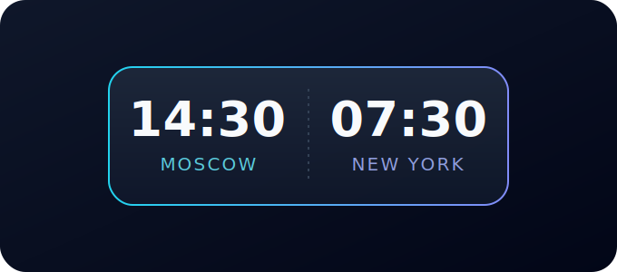

<div align="center">



# ⏱️ Mini Time Widget

**Два часовых пояса в одном компактном виджете для Android.**  
Минималистичный виджет 1×2 без расхода батареи и без единой зависимости.

[English](README.md) · [Русский](README.ru.md)

[](https://github.com/BOSSincrypto/mini-time-widget/releases/latest)
[](https://github.com/BOSSincrypto/mini-time-widget/actions/workflows/build.yml)
[](https://bossincrypto.github.io/mini-time-widget/)
[](LICENSE)

🌐 **Лендинг:** <https://bossincrypto.github.io/mini-time-widget/>  
📦 **Скачать APK:** <https://github.com/BOSSincrypto/mini-time-widget/releases/latest>

</div>

---

> Виджет 1×2 показывает два времени из разных часовых поясов одновременно. Время тикает **бесплатно** через системный `TextClock` — никаких фоновых сервисов, будильников и опросов, поэтому батарея даже не замечает его присутствия.

## ✨ Возможности

- **🧩 Виджет 1×2** — два времени (`Город + HH:mm`) из разных часовых поясов на одном виджете
- **🔋 Нулевой расход батареи** — время тикает через `TextClock` внутри `RemoteViews`; `updatePeriodMillis = 0`, без сервисов и будильников
- **🪶 Ноль зависимостей** — чистый Kotlin + Android SDK (без AndroidX, без Compose); release APK ≈ 33 КБ
- **🎨 Полная настройка** — два часовых пояса (49 встроенных), цвет текста, цвет и прозрачность фона, **5 шрифтов**, формат 12/24 часа, с **живым предпросмотром**
- **👆 Тап = настройки** — тапните по виджету, чтобы открыть настройки; каждый экземпляр хранит свою конфигурацию
- **🌍 49 часовых поясов** — от Гонолулу до Окленда, включая UTC

## 📥 Скачать и установить

1. Скачайте свежий APK: **[mini-time-widget.apk](https://github.com/BOSSincrypto/mini-time-widget/releases/latest/download/mini-time-widget.apk)**
2. Установите его (один раз разрешите установку из браузера)
3. Долгий тап по пустому месту на главном экране → **Виджеты**
4. Найдите **Mini Time 1×2** и перетащите на главный экран
5. Выберите два часовых пояса, шрифт, цвета и формат → **Save**

> Требуется **Android 8.0+ (API 26)**. Само приложение распространяется через GitHub Releases, а лендинг — через GitHub Pages.

## 🛠️ Сборка из исходников

Требования: **JDK 17**, **Android SDK** (compileSdk 34, build-tools 34.0.0).

```bash
# укажите путь к Android SDK (или пропустите, если задан ANDROID_HOME)
echo "sdk.dir=/путь/к/android-sdk" > local.properties

./gradlew assembleDebug      # app/build/outputs/apk/debug/app-debug.apk
./gradlew assembleRelease    # app/build/outputs/apk/release/ (без подписи)
```

Готовый собранный APK также лежит в `prebuilt/app-debug.apk` — можно сразу:
```bash
adb install prebuilt/app-debug.apk
```

## 🤖 Непрерывная поставка (CI/CD)

В репозитории три рабочих процесса GitHub Actions:

| Workflow | Триггер | Что делает |
|---|---|---|
| [`build.yml`](.github/workflows/build.yml) | push / PR в `main` | Собирает debug APK и загружает как артефакт |
| [`release.yml`](.github/workflows/release.yml) | push тега `v*` | Собирает APK и **автоматически публикует GitHub Release** |
| [`pages.yml`](.github/workflows/pages.yml) | push в `main` (`docs/**`) | Деплоит **лендинг** на GitHub Pages |

**Выпустить новый релиз** — достаточно запушить тег, остальное сделает CI:

```bash
git tag v1.0.0
git push origin v1.0.0
```

Лендинг всегда ссылается на свежий APK через редирект `releases/latest/download/...`, поэтому обновляется автоматически.

## 📁 Структура проекта

```
app/src/main/java/dev/minitime/widget/
  TimeWidgetProvider.kt    AppWidgetProvider — строит RemoteViews из настроек
  WidgetConfigActivity.kt  Экран настроек с живым предпросмотром
  WidgetPrefs.kt           Хранение настроек (SharedPreferences, per-widget)
app/src/main/res/
  layout/widget_font_*.xml 5 вариантов виджета (по одному на шрифт)
  layout/activity_config.xml
  xml/widget_info.xml      Метаданные виджета (1×2, resizable)
```

## 🧱 Технологии

Kotlin · Android AppWidgets (`RemoteViews` + `TextClock`) · Gradle Kotlin DSL · R8 minify + shrinkResources · GitHub Actions

## 🤝 Участие

Issues и PR приветствуются! Сначала откройте issue, чтобы обсудить изменения.

## 📄 Лицензия

[MIT](LICENSE) © 2026 BOSSincrypto

<div align="center">

<sub>⭐ Если проект понравился — поставьте звезду!</sub>

`#android` `#kotlin` `#androiddev` `#widget` `#часы` `#часовыепояса` `#мировое_время` `#минимализм` `#opensource` `#github-actions` `#android-widget` `#sideload`

</div>
